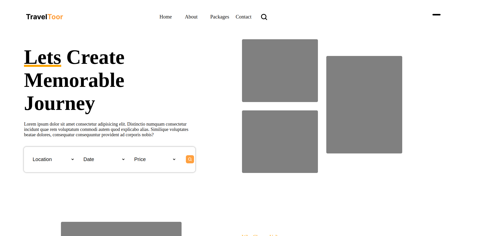

# personal-business-landing-page

# Design by
- [DSingr](https://www.figma.com/community/file/1346829310706100046)

# Links
- [Live - preview](https://azanra.github.io/personal-business-landing-page/)

# About
The project focus on recreating existing design to static pages. The layout
positioned with grid, where in the grid consisted of tracks, row and column
tracks. we set the track with the use of grid template row/column. Similiar
to flexbox, there is grid container and grid item. 

we can position the grid item individually with the help of grid-row and grid-column, which use the row and column line as a basis of the position. and we can use repeat function to set the track amount automatically without writing it manually one by one.

Based on this project my understanding is that, i can use the grid to set the layout of the content if it's two dimentional(having column and row). and for the grid item itself i can set it as flex container to position the grid item (because it's one dimensional).

# Review
For the first few section, i used to create a row track to center the grid
item vertically. This is mainly because i haven't that far in the grid lesson, and turns out we can position the grid item inside the container
with justify and align item/content. Also BE WARNED THAT THE LAYOUT MIGHT
BE BROKEN. Because i use static unit like px instead of dynamic unit like fr
to set the track.

And then because i use svg for some visual element in the design, the html got really bloated becasue of it. main reason is that i'm really lazy to turn it into an image. i can just use the plugin in figma to turn it into html svg code. Even so, i think i can create external file for the svg itself and use import instead of bloating the html, even though the workload
is the same as turning it into an image...

# Screenshot
